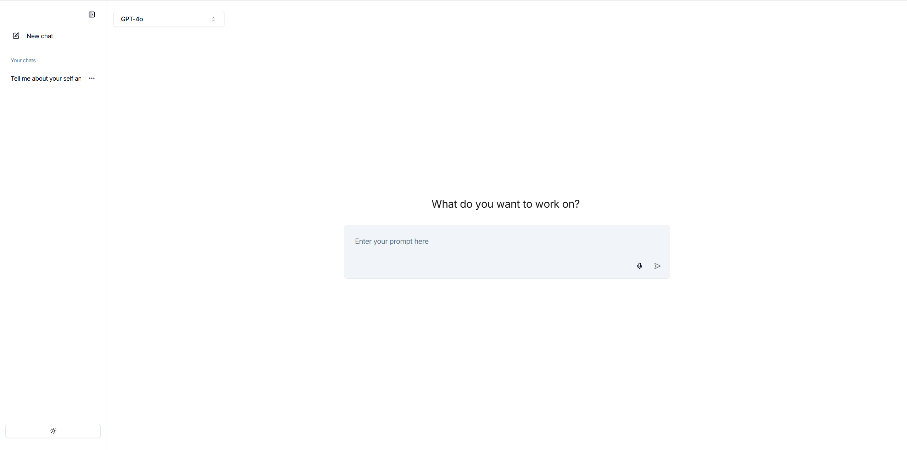
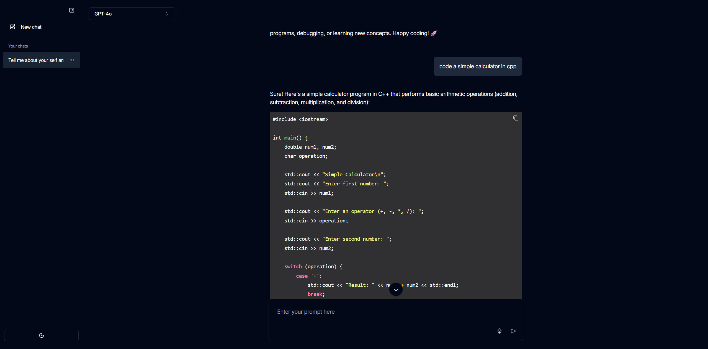

# Local LLM Interface

A clean, minimal chat interface for Ollama.

---

## Demo


|                   Light Theme                    |                Code Preview                |
| :----------------------------------------------: | :----------------------------------------: |
|  |  |

**[Live Demo →](https://local-llm-interface-preview.vercel.app/)**

> The hosted demo uses OpenAI-powered models for preview purposes only.  
> The project itself is designed for local-first usage with Ollama.

---

## Tech Stack

- Next.js 16
- React 19
- TypeScript
- Node.js
- Tailwind CSS
- Ollama
- Vercel AI SDK
- pnpm

---

## Setup

local development:

```bash
pnpm install
pnpm dev
```

build for production:

```bash
pnpm build
pnpm start
```

Open: [http://localhost:3000](http://localhost:3000)

## Configuration

If Ollama isn't at the default address, create `.env.local`:

```env
OLLAMA_URL="http://localhost:11434"
```

---

Built by **Abhishek Bharti**  
[abhishekxbharti.com](https://abhishekxbharti.com)
[abhishekxbharti@gmail.com](mailto:abhishekxbharti@gmail.com)
